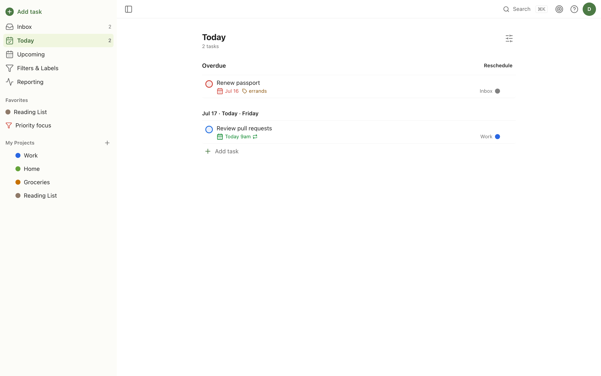
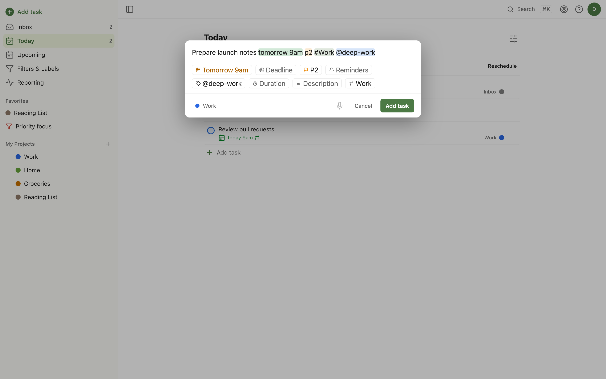

<p align="center">
  
</p>

<h1 align="center">OpenDoist</h1>

<p align="center"><strong>Self-hosted, single-user, keyboard-first task manager — a Todoist-compatible open alternative.</strong></p>

<p align="center">
  <a href="https://github.com/pranav-karra-3301/opendoist/actions/workflows/ci.yml"></a>
  <a href="https://github.com/pranav-karra-3301/opendoist/releases"></a>
  <a href="https://github.com/pranav-karra-3301/opendoist/pkgs/container/opendoist"></a>
  <a href="LICENSE"></a>
  = 22">
</p>

<p align="center">
  <picture>
    <source media="(prefers-color-scheme: dark)" srcset="docs/screenshots/hero-dark.png">
    
  </picture>
</p>

OpenDoist is a task manager you run yourself: one container, one `/data` volume, one account. It speaks
the Todoist workflow you already know — the Quick Add grammar, the filter language, the keyboard map —
without the cloud, the subscription, or the second user you never wanted.

## Features

Everything below is shipped, tested, and in `main`.

**Capture**

| Feature | Notes |
|---|---|
| ✅ Quick Add grammar | Full Todoist syntax — natural-language dates (`tom 4pm`, `mid january`, bare `6pm` → today-or-tomorrow), `#project` `/section` `@label` `p1`–`p4`, `{deadline}`, `!reminders`, `for 45min` duration, plus `// description` and a leading `* ` for uncompletable headers |
| ✅ Recurrence engine | `every` / `every!` (advance from schedule vs. completion), workdays, ordinals (`every 3rd friday`, `every last day`), day/date lists, `starting` / `until` / `for` bounds — DST-safe and property-tested |
| ✅ Ramble (voice capture) | Hold-to-record → pluggable STT (OpenAI-compatible / Deepgram / ElevenLabs / self-hosted Whisper) → optional LLM task extraction → review & confirm |

**Organize**

| Feature | Notes |
|---|---|
| ✅ Tasks & subtasks | Priorities (1 = highest), durations, deadlines, markdown content, comments with attachments, soft delete |
| ✅ Projects & sections | Nested projects, sections, a 20-color palette, favorites, drag-to-reorder |
| ✅ Labels | `@label` with colors and dedicated label views |
| ✅ Filters | The Todoist filter language — `& \| ! ( ) ,` panes, date/deadline/created operators, `p1`–`p4`, `@label*` wildcards, `#Project` / `##Project` (with descendants) / `/Section`, `search:`, `subtask`, `view all` |
| ✅ Search | SQLite FTS5 across content, descriptions, and comments |

**Plan**

| Feature | Notes |
|---|---|
| ✅ Views | Inbox · Today (overdue + reschedule) · Upcoming (week strip, drag between days) · Project / Label / Filter (comma = multiple panes), with per-view group / sort / filter |
| ✅ Keyboard-first | Full web shortcut map, `?` shortcuts overlay, 10 s undo toasts |
| ✅ Command palette | ⌘K fuzzy navigation and actions |
| ✅ Productivity | Daily/weekly goals, streaks, karma, vacation mode, an activity feed, and unlimited history |

**Remind**

| Feature | Notes |
|---|---|
| ✅ Web Push | Installable-PWA push on desktop and mobile (iOS 16.4+ works after Add to Home Screen), with automatic offsets and recurring reminders |
| ✅ Notification channels | ntfy, Gotify, and webhook delivery as alternatives or backups to Web Push |
| ✅ iCal feed | Read-only tasks calendar for Google / Apple Calendar via a tokenized `webcal://` URL |

**Own your data**

| Feature | Notes |
|---|---|
| ✅ Todoist importer | Backup ZIP upload or a live API token — projects, sections, tasks, labels, and comments (priorities remapped, since Todoist stores 4 = highest) |
| ✅ Export | Full JSON snapshot plus per-project CSV |
| ✅ Backups | Nightly `VACUUM INTO` snapshots with retention and one-click restore |

**Platform**

| Feature | Notes |
|---|---|
| ✅ PWA + offline | Installable app with a Workbox app shell; last-viewed lists stay readable offline |
| ✅ REST API | Hono, every route zod-typed → OpenAPI + Scalar docs at `/api/v1/docs`, cursor pagination, SSE live updates, scoped `od_…` API tokens |
| ✅ CLI | `opendoist add "…"` with the identical parser; `--json` on every read command |
| ✅ Auth | Password + TOTP 2FA, generic OIDC SSO; registration auto-locks after the first user |

**Non-goals (v1):** collaboration/sharing, board & calendar layouts, CalDAV, an email reminder channel, native mobile apps (the PWA is the mobile story), and localization.

## Quick start

OpenDoist is one container writing to one volume:

```sh
docker run -d --name opendoist -p 7968:7968 -v ./data:/data ghcr.io/pranav-karra-3301/opendoist
```

Or with Docker Compose:

```yaml
services:
  opendoist:
    image: ghcr.io/pranav-karra-3301/opendoist:latest
    container_name: opendoist
    ports: ["7968:7968"]
    volumes: ["./data:/data"]
```

Then open `http://localhost:7968` and create your account. Registration locks automatically after the
first user; re-open it with `OPENDOIST_ALLOW_REGISTRATION=true`. HTTPS is required for Web Push and PWA
install (localhost is exempt) — see [docs/install.md](docs/install.md).

## Command line

The CLI talks to your instance with the same Quick Add parser as the web app. It ships inside the
container (with an `od` short alias), so the quick start above already installed it — create an API
token in **Settings → Integrations**, then:

```sh
docker exec -e OPENDOIST_TOKEN=od_… opendoist opendoist add "Pay rent tomorrow 9am p1 #Home"
docker exec -e OPENDOIST_TOKEN=od_… opendoist opendoist today
```

(The image already points `OPENDOIST_URL` at the bundled server, so the token is all it needs.)

> **npm package:** `npm install -g opendoist` is planned but **not published yet** at 0.1.0.
> Until it lands, use the bundled binary above, or build from a source checkout with
> `pnpm --filter opendoist build` and run `node packages/cli/dist/index.js`.

Full command reference — including `opendoist login` and env-var configuration — in
[docs/cli.md](docs/cli.md).

## Screenshots

<p align="center">
  
</p>

## Documentation

Full docs live in [`docs/`](docs/):

- [Documentation index](docs/README.md)
- [Install & first run](docs/install.md)
- [Configuration (environment variables)](docs/configuration.md)
- [Import from Todoist](docs/import-todoist.md)
- [Voice capture (Ramble & STT)](docs/voice-ramble.md)
- [Backups & restore](docs/backups.md)
- [REST API](docs/api.md)
- [Command-line client](docs/cli.md)
- [FAQ](docs/faq.md)

## Development

Requires Node ≥ 22 and pnpm 10.

```sh
git clone https://github.com/pranav-karra-3301/opendoist.git
cd opendoist
pnpm install
pnpm verify   # lint + typecheck + test + build, everything CI runs
```

Handy during development:

```sh
pnpm --filter @opendoist/core test   # core engine test suites (golden tables + property tests)
pnpm --filter @opendoist/web dev     # web app (Vite)
pnpm seed                            # load a demo account with example data
pnpm lint:fix                        # Biome, auto-fix
```

See [CONTRIBUTING.md](CONTRIBUTING.md) for commit conventions and the design-token rules.

## Stack

| Layer | Choices |
|---|---|
| Runtime | Node.js ≥ 22 · single Docker container · SQLite on one `/data` volume |
| Monorepo | pnpm workspaces + catalog · TypeScript (strict) · Biome 2 · Vitest 4 + fast-check |
| Core (`packages/core`) | zod 4 · chrono-node · date-fns 4 + `@date-fns/tz` · temporal-polyfill + rrule-temporal — pure, zero-IO, shared by web/server/CLI |
| Server (`apps/server`) | Hono 4 + `@hono/zod-openapi` · Drizzle + better-sqlite3 · better-auth · croner · web-push |
| Web (`apps/web`) | Vite 8 · React 19 · Tailwind 4 · TanStack Query + Router · Base UI · dnd-kit · cmdk · vite-plugin-pwa |
| CLI (`packages/cli`) | commander · tsdown · bundled in the Docker image as `opendoist` / `od` (npm publish planned) |
| Releases | Conventional commits · git-cliff changelog · GHCR images (amd64 + arm64) |

## License

[AGPL-3.0](LICENSE) © Pranav Karra.

Brand icon derived from ["List" by Glyphy](https://thenounproject.com/browse/icons/term/list/) (Noun Project), licensed [CC BY 3.0](https://creativecommons.org/licenses/by/3.0/) — details in [assets/brand/ATTRIBUTION.md](assets/brand/ATTRIBUTION.md).
